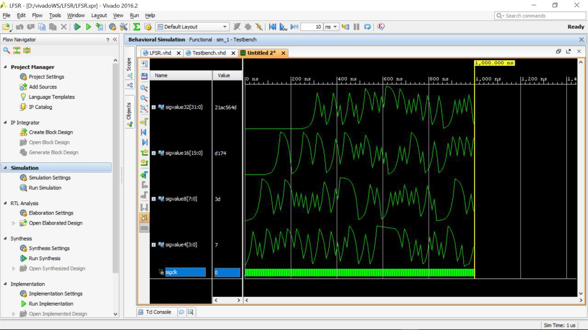
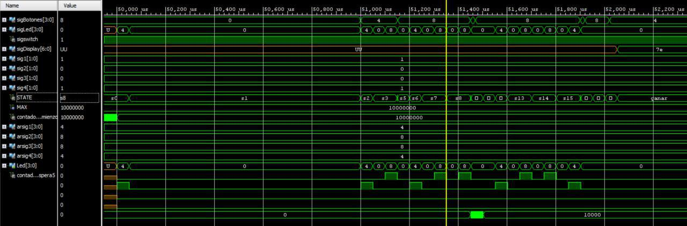

# SimonGameVHDL
Simon game write in vhdl languaje for digilent basys 3  boards

# Pantallazo de la simulación reeliacada a escala

Pantallazo de la simulacion del componente LFSR

Pantallazo de la simulacion del juego al estado perder

Pantallazo de la simulacion del juego al estado ganar

